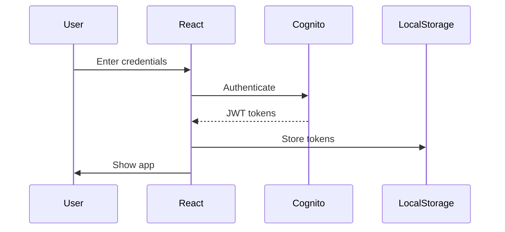
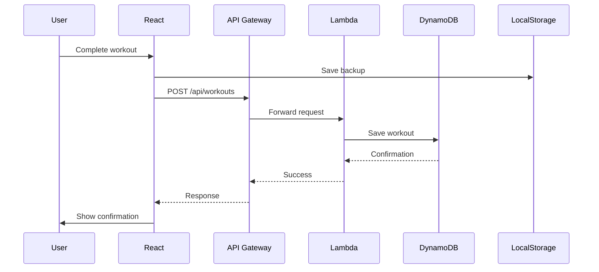
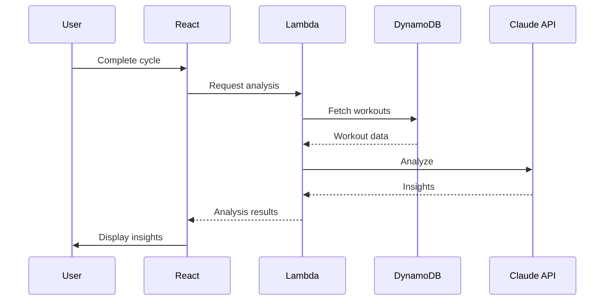

# FitForge Architecture Documentation

## System Overview

FitForge is a serverless, cloud-native Progressive Web Application (PWA) built on AWS infrastructure with a React frontend.

## High-Level Architecture

```
┌──────────────────────────────────────────────────────────────────┐
│                         User Devices                             │
│  (Mobile PWA, Desktop Browser, Tablet)                          │
└─────────────────────┬────────────────────────────────────────────┘
                      │ HTTPS
                      ▼
┌──────────────────────────────────────────────────────────────────┐
│                    CloudFront CDN                                │
│  - Global edge locations                                         │
│  - Static asset caching                                          │
│  - SSL/TLS termination                                          │
└──────────┬──────────────────────────────┬───────────────────────┘
           │                              │
           ▼                              ▼
┌──────────────────────┐      ┌──────────────────────────────────┐
│    S3 Static Site    │      │      API Gateway (HTTP)          │
│  - React SPA         │      │  - RESTful endpoints             │
│  - Assets            │      │  - CORS handling                 │
│  - PWA manifest     │      │  - Rate limiting                 │
└──────────────────────┘      └──────────────┬───────────────────┘
                                             │
                                             ▼
                              ┌──────────────────────────────────┐
                              │       Lambda Function            │
                              │  - Express.js server             │
                              │  - Business logic                │
                              │  - Data validation               │
                              └──────────┬──────────┬────────────┘
                                        │          │
                    ┌───────────────────┼──────────┼──────────────┐
                    ▼                   ▼          ▼              ▼
        ┌──────────────────┐ ┌──────────────┐ ┌──────────┐ ┌──────────┐
        │    DynamoDB      │ │   Cognito    │ │  Secrets │ │  Claude  │
        │  - Workout data  │ │  - Auth      │ │  Manager │ │   API    │
        │  - User profiles │ │  - Users     │ │  - Keys  │ │  - AI    │
        └──────────────────┘ └──────────────┘ └──────────┘ └──────────┘
```

## Component Architecture

### Frontend Components

```
App.jsx
├── Router Configuration
├── Authentication Context
└── Main Routes
    ├── Login.jsx
    │   ├── Sign In Form
    │   ├── Sign Up Form
    │   └── Password Reset
    └── WorkoutTracker.jsx
        ├── WorkoutSelector.jsx
        │   ├── WorkoutCard
        │   ├── CycleProgressRing
        │   └── ProfileSettingsModal
        ├── ExerciseList
        │   ├── ExerciseCard
        │   └── SetTracker
        ├── WorkoutHistory.jsx
        │   ├── Calendar View
        │   ├── List View
        │   └── Stats View
        └── AI Analysis Display
```

### Backend Services

```
Lambda Handler (index.js)
├── Express App
└── API Routes (workoutAPI.js)
    ├── /api/health
    ├── /api/workouts
    ├── /api/analysis
    └── Services
        ├── dynamoService.js
        │   ├── saveWorkout()
        │   ├── getWorkouts()
        │   └── deleteWorkout()
        ├── claudeAnalysis.js
        │   ├── analyzeWorkouts()
        │   └── generateInsights()
        └── secretsManager.js
            └── getSecrets()
```

## Data Flow

### 1. User Authentication Flow



### 2. Workout Save Flow



### 3. AI Analysis Flow



## State Management

### Frontend State

FitForge uses React hooks for state management:

```javascript
// Global State (App.jsx)
- isAuthenticated: boolean
- userEmail: string
- authTokens: object

// Workout State (WorkoutTracker.jsx)
- activeTemplate: number
- workoutData: object
- exerciseRPEs: object
- sessionNotes: string
- workoutComplete: boolean

// UI State
- activeView: 'workout' | 'history'
- showProfileSettings: boolean
- saveStatus: 'idle' | 'saving' | 'saved' | 'error'
```

### Data Persistence

1. **Primary Storage**: DynamoDB
2. **Fallback Storage**: LocalStorage
3. **Cache Strategy**: Write-through with local backup

## Security Architecture

### Authentication & Authorization

```
┌──────────────┐     ┌──────────────┐     ┌──────────────┐
│   Cognito    │────▶│ JWT Tokens   │────▶│   Lambda     │
│  User Pool   │     │  (ID Token)  │     │  Authorizer  │
└──────────────┘     └──────────────┘     └──────────────┘
```

### Security Layers

1. **Network Security**
   - HTTPS everywhere (CloudFront SSL)
   - CORS restricted to specific origins
   - API rate limiting

2. **Application Security**
   - JWT token validation
   - Input sanitization
   - SQL injection prevention (NoSQL)

3. **Data Security**
   - Encryption at rest (DynamoDB)
   - Encryption in transit (TLS)
   - Secrets in AWS Secrets Manager

## Database Schema

### DynamoDB Table Structure

```
Table: fitforge-main
├── Partition Key (PK): String
├── Sort Key (SK): String
└── Global Secondary Index (GSI1)
    ├── GSI1PK: String
    └── GSI1SK: String
```

### Access Patterns

| Pattern | PK | SK | Description |
|---------|----|----|-------------|
| Get user workouts | USER#email | WORKOUT#timestamp | List all workouts |
| Get workout by date | USER#email | WORKOUT#date | Find specific workout |
| Get analysis | USER#email | ANALYSIS#timestamp | Retrieve AI analysis |
| Get user profile | USER#email | PROFILE | User settings |

### Example Item

```json
{
  "PK": "USER#igor@barani.org",
  "SK": "WORKOUT#2025-08-25T10:30:00Z",
  "GSI1PK": "WORKOUT",
  "GSI1SK": "2025-08-25",
  "templateKey": "A_push_power",
  "exercises": {
    "Bench Press": [
      {"weight": 225, "reps": 5}
    ]
  },
  "exerciseRPEs": {
    "Bench Press": 8
  },
  "bodyweight": 185,
  "timestamp": "2025-08-25T10:30:00Z"
}
```

## Performance Optimization

### Frontend Optimization

1. **Code Splitting**
   - Dynamic imports for large components
   - Route-based splitting

2. **Caching Strategy**
   - CloudFront caching for static assets
   - LocalStorage for workout data
   - Service Worker for PWA

3. **Bundle Optimization**
   - Tree shaking with Vite
   - Minification and compression
   - Optimized images

### Backend Optimization

1. **Lambda Performance**
   - Provisioned concurrency for cold starts
   - Connection pooling for DynamoDB
   - Efficient JSON parsing

2. **Database Performance**
   - DynamoDB on-demand billing
   - Optimized GSI for query patterns
   - Batch operations where possible

## Monitoring & Observability

### Metrics Tracked

1. **Application Metrics**
   - User sessions
   - Workout completions
   - API response times
   - Error rates

2. **Infrastructure Metrics**
   - Lambda invocations
   - DynamoDB read/write units
   - CloudFront cache hit ratio
   - S3 bandwidth

### Logging Strategy

```
Frontend Logs → Browser Console
     ↓
API Gateway Logs → CloudWatch
     ↓
Lambda Logs → CloudWatch
     ↓
DynamoDB Streams → CloudWatch
```

## Deployment Architecture

### CI/CD Pipeline

```
GitHub Push
     ↓
GitHub Actions
     ├── Build Frontend
     │   └── Deploy to S3
     ├── Build Backend
     │   └── SAM Deploy
     └── Invalidate CloudFront
```

### Environment Strategy

| Environment | Purpose | URL |
|------------|---------|-----|
| Development | Local testing | http://localhost:5173 |
| Production | Live application | https://www.barani.org/fitforge |

## Scalability Considerations

### Current Capacity

- **Users**: Designed for single user, can scale to 100s
- **Storage**: DynamoDB can handle TBs of data
- **Throughput**: 10 requests/second baseline
- **Global**: CloudFront provides global distribution

### Scaling Strategy

1. **Vertical Scaling**
   - Increase Lambda memory/timeout
   - Increase DynamoDB capacity

2. **Horizontal Scaling**
   - Lambda auto-scales to 1000 concurrent
   - DynamoDB auto-scales with on-demand

## Disaster Recovery

### Backup Strategy

1. **Data Backup**
   - DynamoDB point-in-time recovery
   - LocalStorage provides user-side backup
   - S3 versioning for static assets

2. **Recovery Procedures**
   - RTO: 1 hour
   - RPO: 24 hours
   - Automated backup via AWS Backup

## Cost Optimization

### Current Monthly Costs (Single User)

| Service | Usage | Cost |
|---------|-------|------|
| Lambda | <1K invocations | $0.00 |
| DynamoDB | <1GB storage | $0.00 |
| API Gateway | <1K requests | $0.00 |
| S3 | <1GB storage | $0.01 |
| CloudFront | <1GB transfer | $0.00 |
| Cognito | 1 user | $0.00 |
| **Total** | | **<$1.00** |

### Cost Optimization Strategies

1. Use AWS Free Tier limits
2. DynamoDB on-demand pricing
3. CloudFront caching to reduce origin requests
4. Lambda right-sizing

## Future Architecture Considerations

### Potential Enhancements

1. **Multi-User Support**
   - User isolation in DynamoDB
   - Row-level security
   - Tenant isolation

2. **Real-Time Features**
   - WebSocket support via API Gateway
   - Live workout tracking
   - Social features

3. **Advanced Analytics**
   - Time-series data in Timestream
   - QuickSight dashboards
   - ML-based predictions

4. **Mobile Apps**
   - React Native apps
   - Native device features
   - Offline-first architecture

## Architecture Decision Records (ADRs)

### ADR-001: Serverless Architecture
**Decision**: Use serverless (Lambda, DynamoDB) instead of traditional servers
**Rationale**: Lower costs, automatic scaling, reduced maintenance

### ADR-002: NoSQL Database
**Decision**: Use DynamoDB instead of RDS
**Rationale**: Better fit for document model, cost-effective for single user

### ADR-003: PWA over Native Apps
**Decision**: Build PWA instead of native mobile apps
**Rationale**: Single codebase, easier deployment, adequate features

### ADR-004: Monolithic Lambda
**Decision**: Single Lambda function instead of microservices
**Rationale**: Simpler deployment, lower costs, adequate for current scale

---

## Appendix

### Technology Versions

- Node.js: 18.x
- React: 18.3.1
- AWS SDK: v3
- Express: 4.x
- Vite: 5.4.x

### AWS Resource ARNs

- Lambda: `arn:aws:lambda:us-west-2:*:function:fitforge-api`
- DynamoDB: `arn:aws:dynamodb:us-west-2:*:table/fitforge-main`
- S3: `arn:aws:s3:::barani.org/fitforge/*`

### Useful Commands

```bash
# View Lambda logs
aws logs tail /aws/lambda/fitforge-api --follow

# Check DynamoDB metrics
aws cloudwatch get-metric-statistics \
  --namespace AWS/DynamoDB \
  --metric-name UserErrors \
  --dimensions Name=TableName,Value=fitforge-main \
  --start-time 2025-08-25T00:00:00Z \
  --end-time 2025-08-26T00:00:00Z \
  --period 3600 \
  --statistics Sum
```